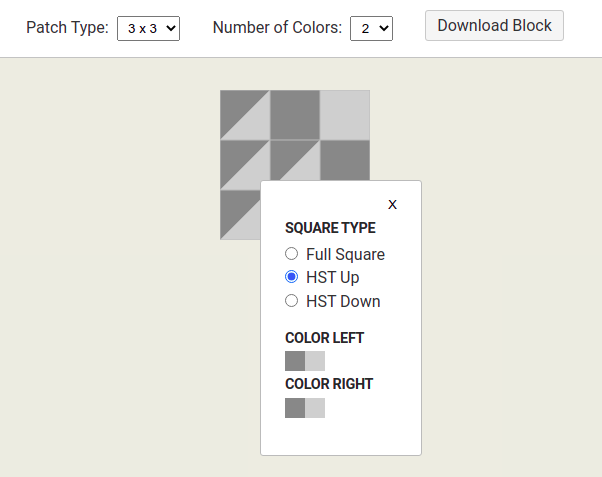

# Block Builder

is a helper tool for building standardized patchwork blocks as .json data.

## Intended use

The individual blocks will be fed into a 'Big Block' pool and can be drawn from there to replace the repetitive task of designing similar blocks over and over within a patchwork pattern.

## Building the blocks

As for now there is a limited number of elements available:

- full squares,
- upward half-square triangle squares,
- downward half-square triangle squares.

For any block the following parameters are available to choose from:

- patch type
  - 2 x 2
  - 3 x 3
  - 4 x 4
  - 5 x 5
  - 6 x 6
  - 7 x 7
  - 8 x 8
  - 9 x 9
- number of colors:
  - 2
  - 3

## Downloading resulting data as .json file

When the block is done, it can be downloaded as a .json file with the following structure
`{ "id": 563390, "rowCol": "3", "colours": "2", "size": 100, "elements": [ "rect", "hst" ], "squaresColor1": 2, "squaresColor2": 1, "squaresColor3": 0, "trianglesColor1": 6, "trianglesColor2": 6, "trianglesColor3": 0, "paths": [ [ { "vertices": [ [0,0], [50,0], [0,50] ], "fillColor": "color1" }, { "vertices": [ [50,0], [50,50], [0,50] ], "fillColor": "color2" } ], [ { .... .... }, { "vertices": [ [150,100], [150,150], [100,150] ], "fillColor": "color2" } ] ] }`

Terms explained:

`rowcol` : the patchtype (here 3 x 3),
`colours` : the amount of colours used,
`elements` : square, hst, or mixed,
`squaresColor1`,
`trianglesColor1` : how many squares or triangles, respectively, come in color1,
`paths` : the points needed to build the svgs programmatically.

The above data is needed for filtering and calculation purposes in the patchwork app.

## Used Tech

React (create-react-app)
